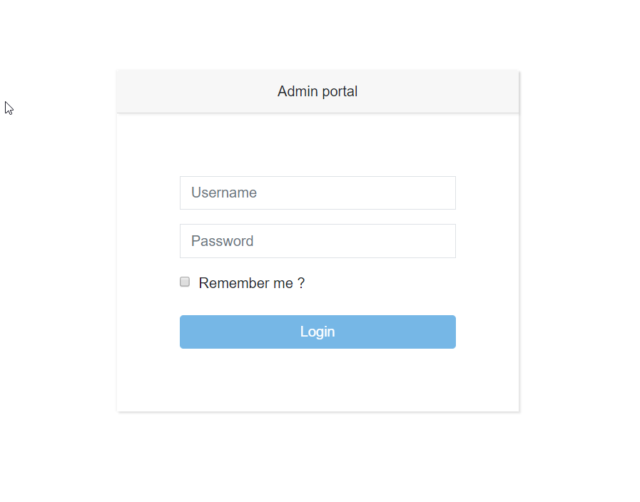
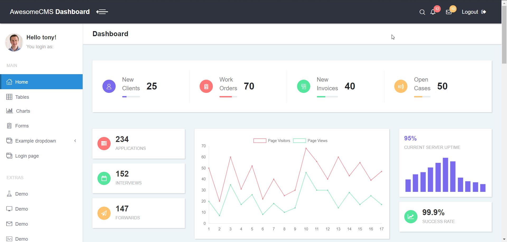
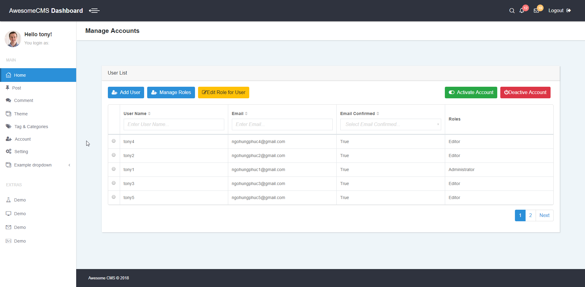
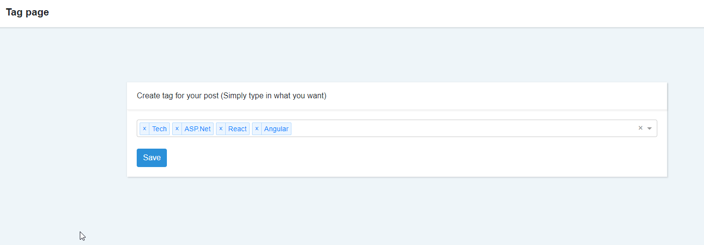

# Awesome Cms Core

Awesome Cms Core is an Open Source Content Management System built using .Net Core

## Build Status

| Build server | Platform      | Status                                                                                                                                                 |
| ------------ | ------------- | ------------------------------------------------------------------------------------------------------------------------------------------------------ |
| AppVeyor     | Windows       |  |
| Travis       | Linux / MacOS |   |

## Code quality

| Platform   | Status                                                                                                                                                                                                                                                                     |
| ---------- | -------------------------------------------------------------------------------------------------------------------------------------------------------------------------------------------------------------------------------------------------------------------------- |
| codebeat   |                                                                                                      |
| codefactor |                                                                                         |
| codacy     |  |

## Docs

Please read

* [Docs](https://awesome-cms-core.gitbooks.io/awesome-cms-core/content/) for setup, prerequisites and project architecture, development guideline etc...

## Graphs

## App insider (Continue to Update)

## Login page for admin

### Portal index

## Manage Account

### Tag manage page

