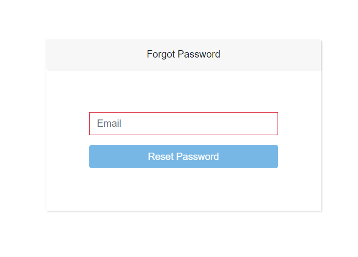
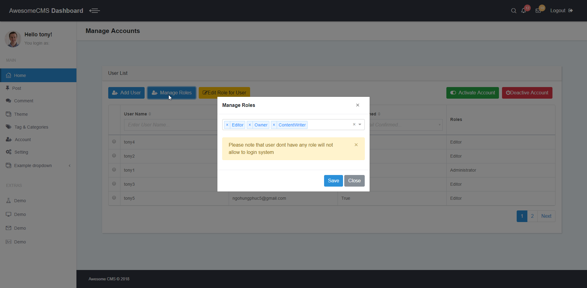
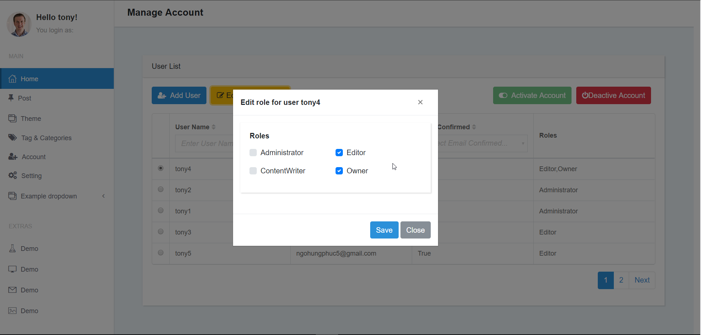
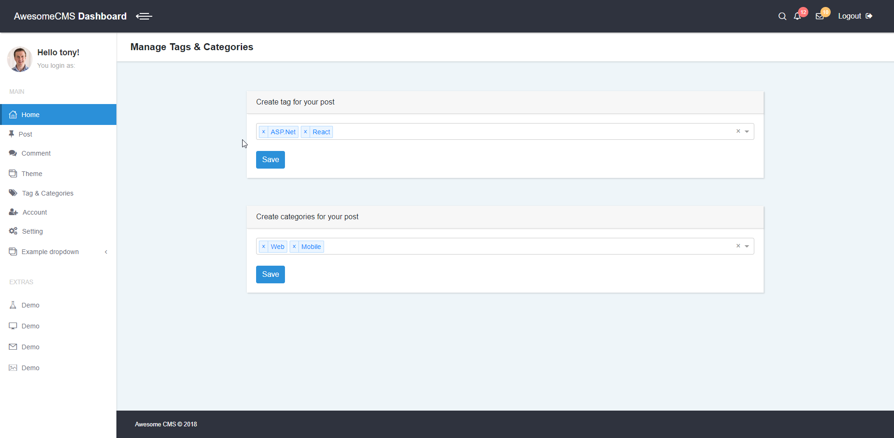

# Awesome CMS Core 

Awesome CMS Core is an open source CMS built using ASP.Net Core & ReactJS with module seperation concern in mind.
Awesome CMS Core provide lastest trend of technology like .Net Core, React, Webpack, SASS, Background Job, Queue.

## Build Status

| Build server | Platform      | Status                                                                                                                                                 |
| ------------ | ------------- | ------------------------------------------------------------------------------------------------------------------------------------------------------ |
| AppVeyor     | Windows       |  |
| Travis       | Linux / MacOS |   |

## Code quality

| Platform   | Status                                                                                                                                                                                                                                                                     |
| ---------- | -------------------------------------------------------------------------------------------------------------------------------------------------------------------------------------------------------------------------------------------------------------------------- |
| codefactor |                                                                                         |
| codacy     |  |

## Docs

Please read

- [Docs](https://awesome-cms-core.gitbook.io/awesome-cms-core/) for setup, prerequisites and project architecture, development guideline etc...

## Contributors

| [Tony Hudson](https://github.com/ngohungphuc)                  | [David Pine](https://github.com/IEvangelist)                        |
| -------------------------------------------------------------- | ------------------------------------------------------------------- |
|  |  |

## App insider (Continue to Update)

### Login page for admin

---

### Portal index

---

### Manage Account

---

### Tag & Categories manage page

---

### Post Manage

---

### Manage comments (Developing)

---
