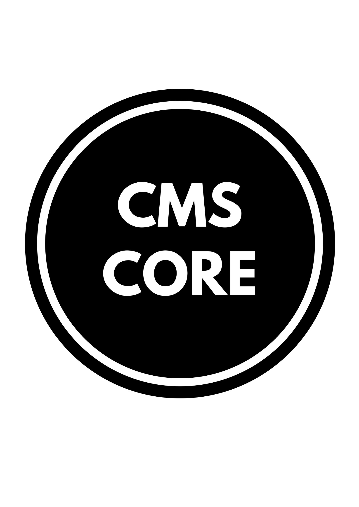

# Awesome CMS Core   

Awesome CMS Core is an open source CMS built using ASP.Net Core & ReactJS with module seperation concern in mind.
Awesome CMS Core provide lastest trend of technology like .Net Core, React, Webpack, SASS, Background Job, Queue.

## Build Status

| Build server | Platform      | Status                                                                                                                                                 |
| ------------ | ------------- | ------------------------------------------------------------------------------------------------------------------------------------------------------ |
| AppVeyor     | Windows       |  |
| Travis       | Linux / MacOS |       |

## Code quality

| Platform   | Status                                                                                                                                                                                                                                                                     |
| ---------- | -------------------------------------------------------------------------------------------------------------------------------------------------------------------------------------------------------------------------------------------------------------------------- |
| codacy     |  |

## Docs

Please read

- [Docs](https://awesome-cms-core.gitbook.io/awesome-cms-core/) for setup, prerequisites and project architecture, development guideline etc...

## Contributors

<table>
  <tbody>
    <tr>
      <td align="center" valign="top">
        
         
        <a href="https://github.com/ngohungphuc">Tony Hudson</a>
        
Main Contributor

      </td>
      <td align="center" valign="top">
        
         
        <a href="https://github.com/IEvangelis">David Pine</a>
        
Contributor

      </td>
      <td align="center" valign="top">
        
         
        <a href="https://github.com/AbelianKraun">Mauro Valvano</a>
        
Contributor

      </td>
     </tr>
  </tbody>
</table>

## Progress

To be updated

## Contributors

This project exists thanks to all the people who contribute. 

## Backers

Thank you to all our backers! 🙏 [[Become a backer](https://opencollective.com/awesomecmscore#backer)]

## Sponsors

Support this project by becoming a sponsor. Your logo will show up here with a link to your website. [[Become a sponsor](https://opencollective.com/awesomecmscore#sponsor)]

