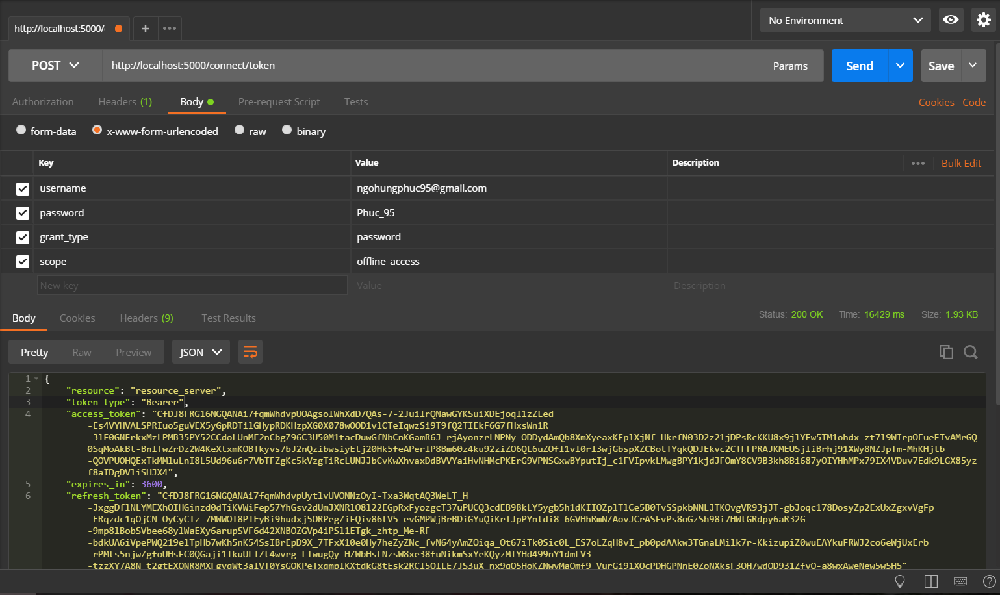
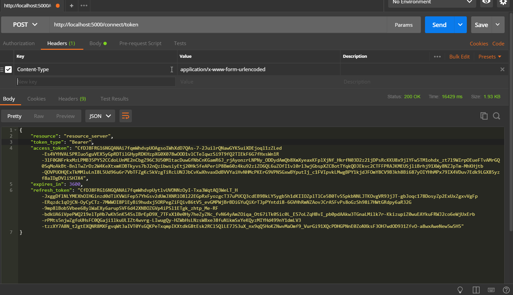
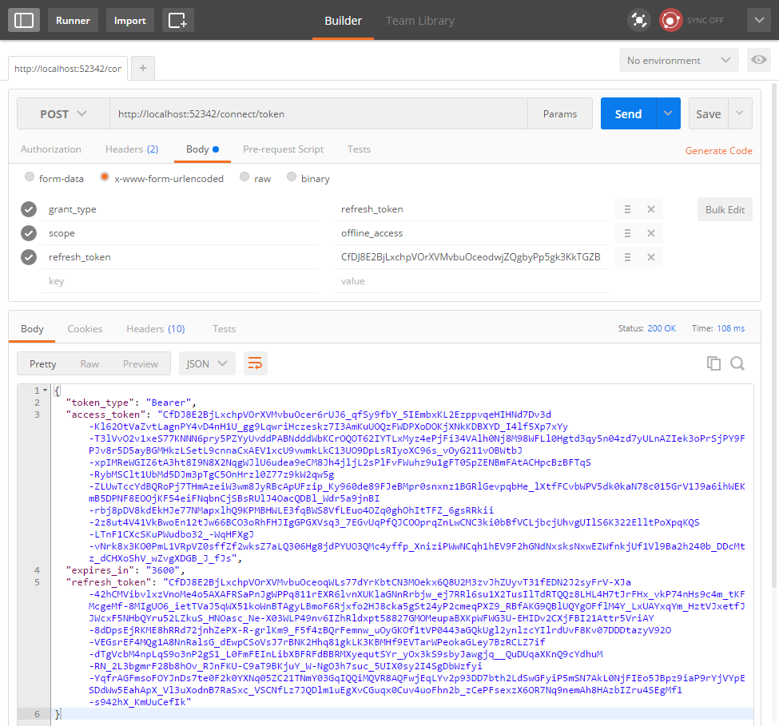

* Thank to @[thienn](https://github.com/thiennn/) for your modular architect. Without your help I wouldnt accomplish this.

---

## Prerequisites

> Frontend

* [ReactJS](https://reactjs.org/docs/hello-world.html)
* [ReactStrap](https://reactstrap.github.io)
* [Webpack](https://webpack.js.org/)
* Drag&Drop (Self develop)
* [NodeJS](https://nodejs.org) Install lts version of node
* [Chart.js](http://www.chartjs.org)

> Backend

* [Visual Studio 2017 version 15.3 with .NET Core SDK 2.0](https://www.microsoft.com/net/core/)
* [ElasticSearch](https://www.elastic.co/guide/en/elasticsearch/reference/current/_installation.html)
* SQL Server
* [Autofac](http://autofaccn.readthedocs.io/en/latest/integration/aspnetcore.html)
* Google Drive API
* [ASP.Net Core 2.0](https://www.microsoft.com/net/download/windows)
* Web API
* SignalR
* RabbitMQ
* WebJob

---

## Run the project

**For backend**

* Change your db connection in appsetting.json and appsetting.dev.json
* Run `src\AwesomeCMSCore\AwesomeCMSCore\migrate.bat` to apply migration.

**For frontend**

* Restore npm package

Currently I use webpack so we need to navigate to Awesome-CMS-Core\src\AwesomeCMSCore\AwesomeCMSCore
then run

```
npm start
```

---

Working dir for frontend is
`\src\AwesomeCMSCore\AwesomeCMSCore\wwwroot\frontend`

## Note

Currently project using Hotmodule replacement for React so the time to bootsup project may take about 3 - 4sec (Just for development).

## Authorization using postman

To authenticate user and get token using postman. Please follow these step

#### Setup authorize infomation



#### Request Header



#### Refresh setup



---

## Project Architecture (Update later)


